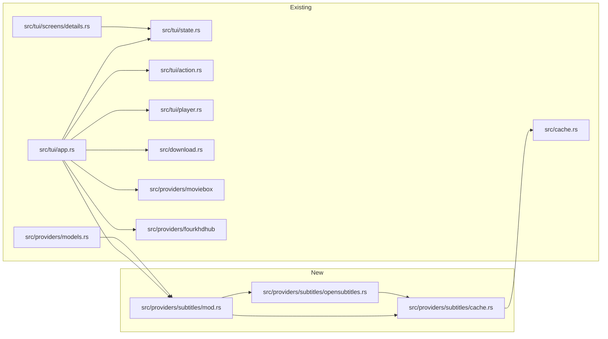

# PLAN — Integrasi Subtitle Bahasa Indonesia via OpenSubtitles API untuk MovieBox-Tui-Indo

> Dokumen ini adalah **rencana implementasi (implementation plan)** yang dapat dieksekusi secara mandiri oleh AI coding agent lain.
> Semua fakta tentang codebase di bawah ini **sudah diverifikasi** dari kode sumber pada tanggal penulisan dokumen ini.
> Fakta tentang API OpenSubtitles yang belum diverifikasi terhadap dokumentasi live ditandai dengan **⚠️ VERIFIKASI**.

---

## 1. Judul & Metadata

| Field | Nilai |
|-------|-------|
| **Judul** | PLAN-SUBTITLE-INDONESIA |
| **Proyek** | MovieBox-Tui-Indo (`moviebox-tui` v0.1.7) |
| **Tanggal dokumen** | 2026-07-31 |
| **Versi plan** | 1.0 |
| **Status** | Draft untuk implementasi (belum ada kode aplikasi yang ditulis) |
| **Rust toolchain** | `rust-version = "1.85.0"`, `edition = "2024"` |
| **Fitur** | Pencarian & download subtitle Bahasa Indonesia dari OpenSubtitles API v3 sebagai fallback saat MovieBox/4KHDHub tidak menyediakan subtitle Indonesia |
| **Lokasi dokumen** | `d:\A - Pribadi\MovieBox-Tui-Indo\PLAN-SUBTITLE-INDONESIA.md` |

---

## 2. Ringkasan Eksekutif

**Tujuan:** Memastikan setiap video yang distream atau didownload dari MovieBox-Tui-Indo **dapat diputar dengan subtitle Bahasa Indonesia**, baik subtitle itu berasal dari MovieBox (sudah ada) maupun dari layanan eksternal OpenSubtitles (baru).

**Pendekatan (3 prinsip kunci):**

1. **Hemat kuota (BYOK + lazy call).** OpenSubtitles hanya dipanggil **saat dibutuhkan**, yaitu ketika MovieBox/4KHDHub **tidak** menyediakan subtitle berbahasa Indonesia. Kredensial API berasal dari env var user (BYOK — `MOVIEBOX_OPENSUBTITLES_*`), tidak pernah di-hardcode. Kuota download (±20/hari, ⚠️ VERIFIKASI) dihemat dengan cache disk.
2. **Memanfaatkan infrastruktur subtitle yang sudah ada.** Popup subtitle (`ShowSubtitlePopup` / `ShowDownloadSubtitlePopup`), mekanisme teruskan subtitle ke mpv/IINA/VLC, dan download `.srt` di samping video **tidak dibuat ulang** — hanya diperluas. Kandidat OpenSubtitles digabung ke daftar popup yang sama dengan label sumber `[OS]`.
3. **Degradasi graceful.** Kegagalan apa pun (tanpa kredensial, rate limit, subtitle tidak ditemukan, network error) **tidak pernah menghalangi pemutaran** — aplikasi tetap play tanpa subtitle, sama seperti perilaku saat ini.

**Hasil akhir yang diharapkan:**
- User set 3–4 env var → buka film/seri → jika tidak ada sub Indo dari MovieBox → daftar subtitle OpenSubtitles muncul di popup → pilih → subtitle terpasang di mpv/VLC/IINA, atau tersimpan sebagai `.srt` saat download video.
- Tanpa env var → perilaku aplikasi **identik** dengan sekarang (zero regression).

---

## 3. Konteks & Batasan

### 3.1 Arsitektur Aplikasi (terverifikasi)

```
MovieBox-Tui-Indo (Rust TUI, ratatui + crossterm)
├── src/main.rs              → entry point, memanggil App
├── src/lib.rs               → pub mod: cache, download, providers, tui
├── src/cache.rs             → cache disk JSON (search/details/stream), TTL 24 jam, hash md5
├── src/download.rs          → download video multi-segment, safe_file_stem, DownloadOutcome
├── src/providers/
│   ├── mod.rs               → pub mod fourkhdhub, iptv_org, models, moviebox
│   ├── models.rs            → ProviderKind, MediaDetails, Release, PlaybackSource, dll
│   ├── moviebox/            → MovieBoxClient (BFF API mobile), ScraperError, crypto
│   ├── fourkhdhub/          → scraper HTML 4khdhub.one + resolver hubcloud
│   └── iptv_org/            → playlist publik iptv-org (tidak relevan untuk fitur ini)
└── src/tui/
    ├── app.rs               → App struct, handler semua Action, clean_moviebox_title
    ├── action.rs            → enum Action (event bus)
    ├── state.rs             → AppState (semua state UI)
    ├── player.rs            → perintah launch mpv/IINA/VLC
    ├── screens/details.rs   → render layar detail + popup subtitle
    └── overlay.rs           → helper `picker` untuk popup list
```

**Aplikasi adalah aggregator/scraper — TIDAK hosting video.** Sumber video:
- **MovieBox** — API BFF mobile (`*.aoneroom.com` / `api.inmoviebox.com`), respons disimpan sebagai `serde_json::Value`.
- **4KHDHub** — scraper HTML `https://4khdhub.one/`, resolusi URL lewat hubcloud.
- **IPTV** — playlist publik iptv-org (di luar cakupan fitur ini).

**Player eksternal:** mpv, IINA (macOS), VLC. Subtitle diteruskan sebagai URL atau path file lokal.

### 3.2 Infrastruktur Subtitle yang SUDAH ADA (wajib dimanfaatkan, terverifikasi)

| Aset | Lokasi | Detail terverifikasi |
|------|--------|----------------------|
| Endpoint `get_ext_captions` | `src/providers/moviebox/mod.rs` baris ~159–167 | `pub async fn get_ext_captions(&self, subject_id: &str, resource_id: &str) -> Result<Value, ScraperError>` → `GET /wefeed-mobile-bff/subject-api/get-ext-captions?subjectId={}&resourceId={}`. Mengembalikan `Value` mentah (hasil `parse_response`, lihat bawah). |
| Parsing respons API | `src/providers/moviebox/client.rs` baris ~176–196 (`parse_response`) | Seluruh payload `data` dipertahankan sebagai `serde_json::Value` — field eksternal apa pun (mis. `imdbId`) dapat dibaca langsung `.get("imdbId")` TANPA mengubah struct. |
| Popup subtitle play | `src/tui/app.rs` baris ~2948–2977 (`Action::ShowSubtitlePopup(link, ext_captions, open_with)`) | Membaca `ext_captions.get("extCaptions")` → array → tiap item ambil `lanName` + `url` → `options: Vec<(String, String)>`. Opsi pertama selalu `("None", "")`. Jika hanya "None" → langsung play tanpa popup. |
| Popup subtitle download | `src/tui/app.rs` baris ~2990–3019 (`Action::ShowDownloadSubtitlePopup(ext_captions)`) | Pola sama; jika hanya "None" → `Action::DownloadStream(None)`. |
| Render popup subtitle | `src/tui/screens/details.rs` baris ~1005–1035 | Iterasi `state.subtitle_list: Vec<(String, String)>`; `"None"` dirender sebagai `"No subtitles"`; memakai `overlay::picker` dengan judul `"Subtitles"`. |
| Teruskan sub ke mpv | `src/tui/player.rs` baris ~72–76 | mpv: `--sub-file={url}`; IINA: `--mpv-sub-files={url}`. |
| Teruskan sub ke VLC | `src/tui/player.rs` baris ~109–110 | VLC: `--sub-file={url}`. |
| Temp download sub utk VLC/IINA | `src/tui/app.rs` baris ~4077–4110 (`Action::LaunchPlayer`) dan ~4130–4170 (`Action::LaunchPlayback`) | Untuk VLC/IINA, URL subtitle diunduh dulu ke `%TEMP%/moviebox_sub_{millis}.srt`, lalu path lokal diteruskan; file temp dihapus 5 detik setelah spawn. |
| Download sub saat download video | `src/tui/app.rs` baris ~480–490 (di dalam `Action::StartDownload` → `start_resilient_download`) | Jika `subtitle_url` ada, spawn task yang GET URL lalu tulis ke `destination.with_extension("srt")` (di samping video). |
| `PlaybackSource.subtitle` | `src/providers/models.rs` (struct `PlaybackSource`) | `pub subtitle: Option<String>` — satu-satunya jalur subtitle untuk pemutaran via `LaunchPlayback`. |
| Detail konten mentah | `src/tui/state.rs` baris ~71 | `pub selected_details: Option<serde_json::Value>` — ID eksternal apa pun (imdbId/doubanId/tmdbId) dapat dibaca langsung tanpa perubahan struct. |
| `SearchResult` | `src/tui/state.rs` baris ~34–43 | `id: String`, `title: String`, `stype: i64`, `release_year: String`, `cover_url: Option<String>`, `season: usize`. |
| `MediaDetails` | `src/providers/models.rs` baris ~79–97 | `imdb_rating: Option<String>` (**SKOR**, bukan ID), `year`, `title`, `seasons`. **TIDAK ada** field `imdbId`/`doubanId`/`tmdbId` di struct mana pun. |
| Cache disk | `src/cache.rs` | `get_provider_details_cache`/`set_provider_details_cache` → file `{cache_dir}/moviebox-tui/{provider_key}/details/details_{subjectId}.json` (prefix `details_`; untuk 4KHDHub `v2_details_...`). Cache stream/search TTL 24 jam. Folder cache root: `dirs::cache_dir()/moviebox-tui/`. |
| 4KHDHub parse details | `src/providers/fourkhdhub/parser.rs` baris ~79–81 | Hanya ekstrak `.imdb-score` (skor, **bukan** ID). Tidak ada imdbId. |
| 4KHDHub resolve release | `src/providers/fourkhdhub/client.rs` baris ~113 | `resolve_release` hardcode `subtitle: None`. |
| Normalisasi judul | `src/tui/app.rs` baris 21–42 | `pub fn clean_moviebox_title(raw_title: &str) -> String` — memotong ` [`, ` (dub)`, ` (hindi)`, dan suffix ` S<digit>...`. |
| Env var pattern existing | `src/providers/fourkhdhub/client.rs` baris ~33 (`MOVIEBOX_FOURKHDHUB_URL`), `src/tui/theme.rs` baris ~145 (`MOVIEBOX_THEME`) | Konvensi prefix `MOVIEBOX_` sudah mapan; dibaca via `std::env::var(...)`. |
| Struct `App` | `src/tui/app.rs` | Punya `client: MovieBoxClient` dan `fourk_client: FourKHdHubClient`; pola spawn `tokio::spawn` + `action_sender.send(...)` dipakai di mana-mana. |
| Dependensi | `Cargo.toml` | `reqwest 0.13.4` (features: `json`, `rustls`, `blocking`), `serde 1.0.228` (derive), `serde_json 1.0.150`, `thiserror 2.0.18`, `tokio 1.52.3` (rt-multi-thread, macros, sync, time, fs, io-util), **`md-5 0.11.0`** (sudah dipakai untuk hash cache di `cache.rs`). |

### 3.3 OpenSubtitles API v3 — Fakta

Base URL: `https://api.opensubtitles.com/api/v1`

| Operasi | Endpoint | Keterangan |
|---------|----------|------------|
| Login | `POST /api/v1/login` | Body `{ "username": "...", "password": "..." }` + header `Api-Key: <client key>` → `{ "user": { "token": "<JWT>" } }`. Token berlaku ±24 jam (⚠️ VERIFIKASI durasi). |
| Search | `GET /api/v1/subtitles` | Param: `query`, `imdb_id`, `season_number`, `episode_number`, `languages` (comma-separated, mis. `id,en`), `type` (`movie`/`episode`), `year`. Respons: `data[]` dengan `id`, `attributes.files[].file_id`, `attributes.language`, `attributes.release_name`, `attributes.download_count`. |
| Download | `POST /api/v1/download` | Body `{ "file_id": <int> }` + header `Api-Key` + `Authorization: Bearer <token>` → `{ "link": "<url sementara>", "file_name": "...", "requests": <int>, "remaining": <int> }`. `link` valid beberapa menit (⚠️ VERIFIKASI). |
| Bahasa Indonesia | — | Kode bahasa: `id`. |
| Free tier | — | ±20 download subtitle/hari (⚠️ VERIFIKASI), rate limit ±10 req/10 detik (⚠️ VERIFIKASI), header respons `X-Quota-*` / `X-RateLimit-*` (⚠️ VERIFIKASI nama header). |
| Konversi format | — | **TIDAK ada** endpoint konversi format. `.srt`/`.vtt` cukup untuk mpv/VLC (mpv & VLC menerima keduanya). |

> **Catatan penting:** sebagian besar detail kuota/rate limit bersifat "berdasarkan pengetahuan, belum diverifikasi terhadap dokumentasi live". Implementasi **harus toleran** terhadap perubahan: jangan pernah meng-hardcode asumsi kuota ke dalam logika (hanya untuk pesan/notifikasi), dan selalu baca header `X-Quota-*`/`X-RateLimit-*` bila tersedia.

### 3.4 Keputusan Desain yang SUDAH DIKONFIRMASI USER (WAJIB dipatuhi)

1. **BYOK** — Kredensial OpenSubtitles dari env var / config file user; **TIDAK PERNAH hardcode** di kode.
2. **Cakupan**: semua provider (MovieBox + 4KHDHub).
   - MovieBox: prioritas `imdbId` (jika tersedia di payload) → fallback fuzzy `title+year`.
   - 4KHDHub: hanya fuzzy `title+year` (tidak ada imdbId).
3. **Perilaku popup**: OpenSubtitles **dipanggil hanya saat** MovieBox tidak menyediakan subtitle Bahasa Indonesia (untuk menghemat kuota). Kandidat OpenSubtitles ditambahkan ke `subtitle_list`/`options` yang sama, ditandai label sumber `[OS]` vs MovieBox (tanpa label).
4. **Prioritas utama**: streaming & download video dengan subtitle Indonesia.

### 3.5 Batasan (Out of Scope)

- Tidak mengubah API MovieBox/4KHDHub.
- Tidak membuat player sendiri.
- Tidak mendukung IPTV (subtitle IPTV di luar cakupan).
- Tidak menerjemahkan subtitle (machine translation OpenSubtitles hanya ditampilkan jika ada, tidak dihasilkan sendiri).
- Tidak membuat fitur upload subtitle.
- Tidak mengubah format penyimpanan video/download.

---

## 4. Arsitektur Fitur

### 4.1 Diagram Alur End-to-End (playback, MovieBox)

```mermaid
flowchart TD
    A[User tekan Enter pada stream di layar Details] --> B{Provider?}
    B -->|MovieBox| C[panggil get_ext_captions subjectId+resourceId]
    B -->|4KHDHub| C2[resolve_release → PlaybackSource.subtitle=None]
    C --> D{extCaptions berhasil?}
    D -->|Tidak| E[Play tanpa subtitle — perilaku existing]
    D -->|Ya| F[Bangun options dari extCaptions]
    F --> G{Ada lanName mengandung Indonesia/Indonesian/Indo?}
    G -->|Ya| H[Tampilkan popup subtitle MovieBox saja]
    G -->|Tidak| I{OpenSubtitles enabled\n& MOVIEBOX_OPENSUBTITLES_ENABLED≠false?}
    I -->|Tidak| H2[Tampilkan popup subtitle MovieBox saja<br/>tanpa kandidat OS]
    I -->|Ya| J[state.subtitle_searching=true + notify 'Mencari subtitle…']
    J --> K[Bangun SubtitleContext dari selected_details]
    K --> L{Ada imdbId di selected_details?}
    L -->|Ya| M[GET /subtitles?imdb_id=ttXXXX&languages=id,en]
    L -->|Tidak| N[GET /subtitles?query=clean_title&year=YYYY<br/>+ season_number/episode_number jika seri]
    M --> O[Cek cache search 7 hari → jika ada pakai cache]
    N --> O
    O --> P{Hasil?}
    P -->|Tidak ada / error| Q[Popup MovieBox saja; jika hanya None → play tanpa sub]
    P -->|Ada| R[Skor & urutkan kandidat]
    R --> S[Action::OpenSubtitlesReady → gabung ke subtitle_list dengan label [OS]]
    S --> T[Popup subtitle: MovieBox + OS]
    C2 --> U{Buka dengan player picker?}
    U -->|Ya| V[ShowPlaybackPicker source; sub dibiarkan None dulu]
    U -->|Tidak| W[LaunchPlayback mpv]
    T --> X{User pilih?}
    X -->|None| Y[Play tanpa subtitle]
    X -->|Kandidat OS| Z[Dapatkan URL .srt → teruskan ke player<br/>/ download ke cache sebelum launch]
    X -->|Kandidat MovieBox| AA[Teruskan URL MovieBox seperti sekarang]
    Y --> END[Video diputar]
    Z --> END
    AA --> END
    V --> END2[User pilih player → LaunchPlayback]
    W --> END2
```

> **Catatan alur 4KHDHub:** karena `resolve_release` selalu menghasilkan `subtitle: None` dan tidak ada `get_ext_captions` untuk 4KHDHub, fallback OpenSubtitles untuk 4KHDHub dijalankan **setelah** `resolve_release` berhasil: cari fuzzy `title+year` (dan `season/episode` jika seri), lalu set `source.subtitle` sebelum `LaunchPlayback`/`ShowPlaybackPicker`. Detail ada di §6.3.

### 4.2 Diagram Alur Download

```mermaid
flowchart TD
    A[User pilih Download episode/seri] --> B[Fetch get_ext_captions seperti sekarang]
    B --> C{Bangun options & ada sub Indo?}
    C -->|Ya| D[ShowDownloadSubtitlePopup MovieBox]
    C -->|Tidak| E{OS enabled?}
    E -->|Tidak| F[DownloadStream None]
    E -->|Ya| G[Search OpenSubtitles async → gabung [OS] → ShowDownloadSubtitlePopup]
    D --> H{User pilih}
    G --> H
    H -->|None| F
    H -->|Kandidat| I[DownloadStream sub_url]
    I --> J[Action::StartDownload sub_url + link]
    J --> K[Download video + tulis .srt di samping video<br/>- jalur existing app.rs ~480-490]
    F --> K
```

### 4.3 Diagram Arsitektur Modul Baru



---

## 5. Spesifikasi Modul Baru

> Semua kode di bawah adalah **spesifikasi tanda tangan** (sketsa). Implementer harus menyesuaikan gaya kode dengan repo (mis. `thiserror`, pola `Option::and_then`, `tokio::spawn`).

Tambahkan deklarasi modul di `src/providers/mod.rs` (baris saat ini hanya `pub mod fourkhdhub; pub mod iptv_org; pub mod models; pub mod moviebox;`):

```rust
pub mod fourkhdhub;
pub mod iptv_org;
pub mod models;
pub mod moviebox;
pub mod subtitles;   // <-- BARU
```

### 5.1 `src/providers/subtitles/mod.rs`

Berkas orkestrasi: definisi kontrak provider subtitle + tipe bersama.

```rust
//! Provider subtitle eksternal (OpenSubtitles) dengan cache disk.
//!
//! Tujuan: fallback subtitle Bahasa Indonesia saat provider utama
//! (MovieBox/4KHDHub) tidak menyediakannya. Dipanggil hanya bila perlu
//! untuk menghemat kuota harian OpenSubtitles.

pub mod cache;
pub mod opensubtitles;

use crate::providers::models::ProviderKind;
use opensubtitles::{OpenSubtitlesClient, OpenSubtitlesError, SearchResponse};

/// Identitas media yang sedang diputar/diunduh, untuk query subtitle.
/// Dikonstruksi dari `AppState.selected_details` (serde_json::Value)
/// + `active_subject_id` + `get_selected_resource_id()`.
#[derive(Debug, Clone, Default)]
pub struct SubtitleContext {
    pub provider: ProviderKind,
    pub subject_id: String,
    pub resource_id: String,
    /// Judul setelah `clean_moviebox_title` (src/tui/app.rs).
    pub title: String,
    /// Tahun 4 digit, mis. "2019". Sumber: `releaseDate`/`year`/`release_year`.
    pub year: Option<String>,
    /// true jika seri (subjectType == 2 / stype == 2).
    pub is_episode: bool,
    pub season: Option<usize>,
    pub episode: Option<usize>,
    /// ID eksternal bila tersedia (imdbId/doubanId/tmdbId) — dibaca dari Value.
    pub imdb_id: Option<String>,
}

/// Kandidat subtitle hasil pencarian OpenSubtitles, sudah diskor & diurutkan.
#[derive(Debug, Clone)]
pub struct OsCandidate {
    /// Label tampilan, mis. `"Indonesian [OS] · 1080p WEB-DL · 123 dl"`.
    pub label: String,
    /// file_id untuk dipakai di POST /download.
    pub file_id: u32,
    /// Bahasa (kode, mis. "id").
    pub language: String,
    /// Skor matching (lihat §7). Lebih tinggi = lebih relevan.
    pub score: i32,
    /// release_name mentah dari API (untuk label).
    pub release_name: Option<String>,
    /// jumlah download (untuk label & tie-break).
    pub download_count: Option<u32>,
    /// true jika `ai_translated` atau `machine_translated` true.
    pub machine_translated: bool,
}

/// Hasil pencarian yang sudah diolah untuk UI.
#[derive(Debug, Clone, Default)]
pub struct OsSearchOutcome {
    /// Kandidat terurut (best first), bahasa `id` didahulukan.
    pub candidates: Vec<OsCandidate>,
    /// true bila respons diambil dari cache (untuk statistik/debug).
    pub from_cache: bool,
}

/// Trait provider subtitle. Saat ini satu implementasi: OpenSubtitles.
/// Dipisah agar provider lain (mis. subscene, opensubtitles.org) bisa
/// ditambahkan tanpa mengubah UI.
#[allow(async_fn_in_trait)] // crate ini pakai tokio; jika warn, gunakan async-trait — Cek dulu.
pub trait SubtitleProvider: Send + Sync {
    fn enabled(&self) -> bool;
    async fn search(&self, ctx: &SubtitleContext) -> Result<OsSearchOutcome, SubtitleError>;
    /// Unduh subtitle (via URL sementara dari POST /download) → bytes.
    async fn download(&self, candidate: &OsCandidate) -> Result<Vec<u8>, SubtitleError>;
}

/// Error terpadu provider subtitle.
#[derive(Debug, thiserror::Error)]
pub enum SubtitleError {
    #[error("OpenSubtitles: {0}")]
    OpenSubtitles(#[from] OpenSubtitlesError),
    #[error("Subtitle not found")]
    NotFound,
    #[error("subtitle provider disabled")]
    Disabled,
}

/// Helper: gabungkan kandidat OS ke daftar popup `Vec<(String, String)>`.
/// Label diberi suffix ` [OS]` bila belum mengandung `[OS]`.
pub fn merge_os_candidates(
    base: Vec<(String, String)>,
    candidates: &[OsCandidate],
) -> Vec<(String, String)> {
    // Sketsa — sesuaikan:
    // untuk tiap candidate: base.push((format!("{} [OS]", label), format!("os:{}", file_id)))
    // label = bahasa + (release_name singkat) + (download_count)
    // Lalu dedup: jangan tambahkan bila base sudah punya label yang sama persis.
    // (implementasi penuh ada di §7.6)
    base
}

/// Deteksi label bahasa Indonesia pada lanName MovieBox.
/// Cocokkan substring: "indonesia", "indonesian", "indo", "bahasa", atau tepat "id".
pub fn is_indonesian_label(name: &str) -> bool {
    let lower = name.to_ascii_lowercase();
    lower.contains("indonesia")
        || lower.contains("indonesian")
        || lower.contains("indo")
        || lower.contains("bahasa")
        || lower.trim() == "id"
}
```

### 5.2 `src/providers/subtitles/opensubtitles.rs`

Client HTTP untuk OpenSubtitles API v3.

```rust
//! Client untuk OpenSubtitles API v3 (api.opensubtitles.com).
//!
//! BYOK: kredensial dari env var (lihat `OpenSubtitlesConfig::from_env`).
//! TIDAK PERNAH ada kredensial hardcode di file ini.

use crate::providers::subtitles::{OsCandidate, OsSearchOutcome, SubtitleContext};
use serde::Deserialize;
use std::sync::Arc;
use tokio::sync::Mutex;

pub const BASE_URL: &str = "https://api.opensubtitles.com/api/v1";

// ---------------------------------------------------------------- Config

#[derive(Debug, Clone, Default)]
pub struct OpenSubtitlesConfig {
    pub api_key: Option<String>,
    pub username: Option<String>,
    pub password: Option<String>,
    /// Daftar kode bahasa untuk query `languages`; default ["id", "en"].
    pub languages: Vec<String>,
    /// Master switch. Default true; jika false, fitur mati total.
    pub enabled: bool,
}

impl OpenSubtitlesConfig {
    /// Baca dari env var. Semua opsional; `enabled()` menentukan apakah dipakai.
    pub fn from_env() -> Self {
        let enabled = std::env::var("MOVIEBOX_OPENSUBTITLES_ENABLED")
            .map(|v| !v.eq_ignore_ascii_case("false") && v != "0")
            .unwrap_or(true);
        let languages = std::env::var("MOVIEBOX_OPENSUBTITLES_LANGUAGES")
            .map(|v| {
                v.split(',')
                    .map(|s| s.trim().to_string())
                    .filter(|s| !s.is_empty())
                    .collect::<Vec<_>>()
            })
            .filter(|v| !v.is_empty())
            .unwrap_or_else(|| vec!["id".to_string(), "en".to_string()]);
        Self {
            api_key: std::env::var("MOVIEBOX_OPENSUBTITLES_API_KEY").ok(),
            username: std::env::var("MOVIEBOX_OPENSUBTITLES_USERNAME").ok(),
            password: std::env::var("MOVIEBOX_OPENSUBTITLES_PASSWORD").ok(),
            languages,
            enabled,
        }
    }

    /// true hanya jika enabled && api_key && username && password ada & non-empty.
    pub fn enabled(&self) -> bool {
        self.enabled
            && self
                .api_key
                .as_deref()
                .is_some_and(|s| !s.is_empty())
            && self
                .username
                .as_deref()
                .is_some_and(|s| !s.is_empty())
            && self
                .password
                .as_deref()
                .is_some_and(|s| !s.is_empty())
    }
}

// ---------------------------------------------------------------- Errors

#[derive(Debug, thiserror::Error)]
pub enum OpenSubtitlesError {
    #[error("missing OpenSubtitles credential: {0}")]
    MissingCredentials(&'static str),
    #[error("login failed: HTTP {0}")]
    LoginHttp(u16),
    #[error("login response has no token")]
    MissingToken,
    #[error("OpenSubtitles API error: HTTP {0}")]
    Http(u16),
    #[error("rate limited (retry after ~{0}s)")]
    RateLimited(u64),
    #[error("download quota exhausted: {0}")]
    Quota(String),
    #[error("subtitle not found")]
    NotFound,
    #[error("reqwest error: {0}")]
    Reqwest(#[from] reqwest::Error),
    #[error("JSON error: {0}")]
    Json(#[from] serde_json::Error),
}

// ---------------------------------------------------------------- Client

#[derive(Clone)]
pub struct OpenSubtitlesClient {
    http: reqwest::Client,
    config: OpenSubtitlesConfig,
    token: Arc<Mutex<Option<String>>>,
    /// Detik epoch saat login terakhir (untuk menghindari login berulang).
    last_login_at: Arc<Mutex<Option<u64>>>,
}

impl OpenSubtitlesClient {
    pub fn new(config: OpenSubtitlesConfig) -> Self {
        let http = reqwest::Client::builder()
            .timeout(std::time::Duration::from_secs(12))
            .connect_timeout(std::time::Duration::from_secs(5))
            .build()
            .unwrap_or_else(|_| reqwest::Client::new());
        Self {
            http,
            config,
            token: Arc::new(Mutex::new(None)),
            last_login_at: Arc::new(Mutex::new(None)),
        }
    }

    pub fn from_env() -> Self {
        Self::new(OpenSubtitlesConfig::from_env())
    }

    pub fn enabled(&self) -> bool {
        self.config.enabled()
    }

    pub fn languages(&self) -> &[String] {
        &self.config.languages
    }

    /// Ambil token; login ulang bila belum ada atau sudah >20 jam.
    pub async fn ensure_token(&self) -> Result<String, OpenSubtitlesError> {
        // Sketsa:
        // 1. lock token — jika Some dan last_login < 20 jam lalu, return clone.
        // 2. POST {BASE_URL}/login  body {"username":..,"password":..}
        //    header: Api-Key: <api_key>, Content-Type: application/json
        // 3. parse LoginResponse → simpan token, update last_login_at.
        // 4. 401/403 → LoginHttp(status); 429 → RateLimited.
        todo!()
    }

    /// Search. Jika `ctx.imdb_id` Some → pakai imdb_id; else query+year.
    /// Selalu sertakan `languages` = config.languages.
    /// Cek cache search 7 hari DULU (lihat modul cache).
    pub async fn search(&self, ctx: &SubtitleContext) -> Result<OsSearchOutcome, OpenSubtitlesError> {
        // Sketsa:
        // 1. bangun param (lihat §7)
        // 2. cek cache search (cache::get_search_cache)
        // 3. GET {BASE_URL}/subtitles
        //    header: Api-Key, (token tidak wajib utk search — ⚠️ VERIFIKASI)
        // 4. parse SearchResponse → pilih bahasa id dulu → score & sort (§7.5)
        // 5. simpan cache search
        todo!()
    }

    /// POST /download untuk mendapatkan URL sementara.
    pub async fn download_link(&self, file_id: u32) -> Result<DownloadResponse, OpenSubtitlesError> {
        // Sketsa:
        // token = self.ensure_token().await?
        // POST {BASE_URL}/download  body {"file_id": file_id}
        // header: Api-Key, Authorization: Bearer <token>
        // 429 → baca retry-after → RateLimited; 400/401/402 → Quota/Http
        todo!()
    }

    /// GET link (URL sementara) → bytes subtitle. Tulis ke cache disk (§8).
    pub async fn fetch_bytes(&self, link: &str) -> Result<Vec<u8>, OpenSubtitlesError> {
        // Sketsa: self.http.get(link).send().await?.error_for_status()?.bytes().await
        todo!()
    }
}

// ---------------------------------------------------------------- DTO (Deserialize)

#[derive(Debug, Clone, Deserialize)]
pub struct LoginResponse {
    pub user: LoginUser,
    #[serde(default)]
    pub status: Option<u16>,
}

#[derive(Debug, Clone, Deserialize)]
pub struct LoginUser {
    pub token: String,
    // field lain (allowed_requests, remaining_downloads, ...) diabaikan.
}

#[derive(Debug, Clone, Deserialize)]
pub struct SearchResponse {
    #[serde(default)]
    pub total_count: Option<u32>,
    #[serde(default)]
    pub data: Vec<SubtitleItem>,
}

#[derive(Debug, Clone, Deserialize)]
pub struct SubtitleItem {
    pub id: String,
    #[serde(rename = "type", default)]
    pub item_type: Option<String>,
    pub attributes: SubtitleAttributes,
}

#[derive(Debug, Clone, Deserialize)]
pub struct SubtitleAttributes {
    #[serde(default)]
    pub language: Option<String>,
    #[serde(rename = "release_name", default)]
    pub release_name: Option<String>,
    #[serde(default)]
    pub files: Vec<SubtitleFile>,
    #[serde(rename = "download_count", default)]
    pub download_count: Option<u32>,
    #[serde(rename = "ai_translated", default)]
    pub ai_translated: Option<bool>,
    #[serde(rename = "machine_translated", default)]
    pub machine_translated: Option<bool>,
}

#[derive(Debug, Clone, Deserialize)]
pub struct SubtitleFile {
    #[serde(rename = "file_id")]
    pub file_id: u32,
    #[serde(rename = "file_name", default)]
    pub file_name: Option<String>,
}

#[derive(Debug, Clone, Deserialize)]
pub struct DownloadResponse {
    pub link: String,
    #[serde(rename = "file_name", default)]
    pub file_name: Option<String>,
    #[serde(default)]
    pub requests: Option<u32>,
    #[serde(default)]
    pub remaining: Option<u32>,
}
```

#### 5.2.1 Contoh Request/Response JSON (untuk fixture & dokumentasi)

**POST `/api/v1/login`**

Request:
```json
{
  "username": "user@example.com",
  "password": "s3cret"
}
```
Headers: `Api-Key: <client-key>`, `Content-Type: application/json`

Response `200 OK`:
```json
{
  "user": {
    "allowed_requests": 100,
    "level": "free",
    "remaining_downloads": 20,
    "token": "eyJhbGciOiJIUzI1NiJ9...."
  },
  "status": 200
}
```
> ⚠️ VERIFIKASI: nama field `allowed_requests` / `remaining_downloads` / `level` — hanya `user.token` yang wajib untuk implementasi.

**GET `/api/v1/subtitles?query=the+avengers&year=2012&languages=id,en&type=movie`**

Headers: `Api-Key: <client-key>`

Response `200 OK`:
```json
{
  "total_count": 42,
  "per_page": 30,
  "page": 1,
  "data": [
    {
      "id": "2098224",
      "type": "movie",
      "attributes": {
        "subtitle_id": 2098224,
        "language": "id",
        "download_count": 4521,
        "release_name": "The.Avengers.2012.1080p.BluRay.x264",
        "ai_translated": false,
        "machine_translated": false,
        "files": [
          { "file_id": 5091684, "cd_number": 1, "file_name": "The.Avengers.2012.1080p.BluRay.x264.srt" }
        ]
      }
    }
  ]
}
```
> ⚠️ VERIFIKASI: field `language` bisa berupa kode (`"id"`) atau nama (`"Indonesian"`) tergantung respons — implementasi harus toleran (cek kedua-duanya).

**GET `/api/v1/subtitles?imdb_id=tt0848228&languages=id&type=movie`** → struktur respons sama.

**POST `/api/v1/download`**

Request:
```json
{ "file_id": 5091684 }
```
Headers: `Api-Key: <client-key>`, `Authorization: Bearer <token>`, `Content-Type: application/json`

Response `200 OK`:
```json
{
  "link": "https://dl.opensubtitles.org/en/download/filead/src-api/...",
  "file_name": "The.Avengers.2012.1080p.BluRay.x264.srt",
  "requests": 17,
  "remaining": 3
}
```
Response error yang mungkin: `401 Unauthorized`, `404 Not Found`, `429 Too Many Requests`, `402` (kuota habis, body berisi `{ "message": "...quota..." }`).

### 5.3 `src/providers/subtitles/cache.rs`

Cache subtitle di disk + cache hasil search + cache kuota.

```rust
//! Cache subtitle OpenSubtitles.
//!
//! Struktur direktori (di bawah dirs::cache_dir()/moviebox-tui/):
//!   subtitles/           ← file .srt yang sudah diunduh (hash key → {key}.srt)
//!   subtitles/search/    ← JSON respons search (TTL 7 hari)
//!   subtitles/quota.json ← snapshot kuota harian

use crate::providers::models::ProviderKind;
use std::path::PathBuf;

pub const SUBTITLE_FILE_TTL_SECS: u64 = 30 * 24 * 60 * 60; // 30 hari
pub const SEARCH_CACHE_TTL_SECS: u64 = 7 * 24 * 60 * 60;   // 7 hari

/// Root: {cache_dir}/moviebox-tui/subtitles
pub fn subtitle_root() -> PathBuf {
    let mut path = dirs::cache_dir().unwrap_or_else(std::env::temp_dir);
    path.push("moviebox-tui");
    path.push("subtitles");
    path
}

/// Key hash md5 — REUSE md-5 (sudah ada di Cargo.toml, dipakai cache.rs).
/// Input: "moviebox|subjectId|season|episode|id|1.0" atau "fourkhdhub|path|0|0|id|1.0"
pub fn hash_key(parts: &[&str]) -> String {
    use md5::{Digest, Md5};
    let mut hasher = Md5::new();
    hasher.update(parts.join("|").as_bytes());
    let digest = hasher.finalize();
    digest.iter().map(|b| format!("{b:02x}")).collect()
}

/// Path file .srt cache untuk satu (provider, subject, season, episode, lang).
/// Tidak membuat direktori (lakukan di set_*).
pub fn subtitle_path(
    provider: ProviderKind,
    subject_id: &str,
    season: usize,
    episode: usize,
    lang: &str,
) -> PathBuf {
    let key = hash_key(&[
        provider.cache_key(),
        subject_id,
        &season.to_string(),
        &episode.to_string(),
        lang,
        env!("CARGO_PKG_VERSION"),
    ]);
    subtitle_root().join(format!("{key}.srt"))
}

/// Ambil path cache jika ada dan masih dalam TTL. None jika tidak ada/kadaluarsa.
pub fn get_cached_subtitle_path(path: &PathBuf) -> Option<PathBuf> {
    // Sketsa: cek path.exists(); cek metadata.modified().elapsed() <= TTL;
    // jika expired → fs::remove_file dan return None. (pola sama dgn cache.rs read_json_cache)
    todo!()
}

/// Tulis bytes subtitle ke path cache (buat direktori bila perlu).
pub fn set_subtitle_cache(path: &PathBuf, bytes: &[u8]) -> std::io::Result<()> {
    // Sketsa: create_dir_all(parent); fs::write(path, bytes) (atau tokio::fs).
    todo!()
}

// ---- Cache search ----

pub fn search_cache_path(query_key: &str) -> PathBuf {
    subtitle_root().join("search").join(format!("{query_key}.json"))
}

/// query_key = hash md5 dari parameter search ter-normalisasi (lihat §8.2).
pub fn search_query_key(ctx: &crate::providers::subtitles::SubtitleContext) -> String {
    // Sketsa: gabungkan imdb_id|title|year|season|episode|languages.join(",")
    hash_key(&[
        ctx.imdb_id.as_deref().unwrap_or(""),
        &ctx.title,
        ctx.year.as_deref().unwrap_or(""),
        &ctx.season.unwrap_or(0).to_string(),
        &ctx.episode.unwrap_or(0).to_string(),
        &"id,en".to_string(), // bahasa konfigurasi
    ])
}

pub fn get_search_cache(key: &str) -> Option<serde_json::Value> {
    // Sketsa: baca file JSON, cek TTL 7 hari, return Value.
    todo!()
}

pub fn set_search_cache(key: &str, value: &serde_json::Value) {
    // Sketsa: write JSON atomik (pola write_json_cache di cache.rs).
    todo!()
}

// ---- Cache kuota ----

#[derive(Debug, Clone, serde::Serialize, serde::Deserialize)]
pub struct QuotaInfo {
    pub requests: u32,
    pub remaining: u32,
    /// epoch detik saat snapshot diambil.
    pub updated_at: u64,
}

pub fn get_quota_cache() -> Option<QuotaInfo> {
    // Sketsa: baca {root}/quota.json. TTL harian (24 jam).
    todo!()
}

pub fn set_quota_cache(quota: &QuotaInfo) {
    // Sketsa: tulis {root}/quota.json.
    todo!()
}
```

### 5.4 Perubahan `Cargo.toml`

**Hasil pengecekan `Cargo.toml` (terverifikasi):**

- `reqwest` ✅ **sudah ada** (`0.13.4`, features `json`, `rustls`, `blocking`). `json` sudah cukup — TIDAK perlu tambah fitur.
- `serde` ✅ **sudah ada** (`1.0.228`, fitur `derive`).
- `serde_json` ✅ **sudah ada** (`1.0.150`).
- `thiserror` ✅ **sudah ada** (`2.0.18`).
- `tokio` ✅ **sudah ada** (`1.52.3`).
- `md-5` ✅ **sudah ada** (`0.11.0`) — dipakai `cache.rs` untuk hash nama file cache search.

**Kesimpulan:** **TIDAK PERLU menambah dependensi apa pun.** Khusus untuk hash cache subtitle, **pakai `md-5` yang sudah ada** (konsisten dengan pola `get_provider_search_path` di `src/cache.rs`) — **jangan** menambah `sha2` (tidak diperlukan, menambah bobot build).

> Jika implementer memutuskan tetap ingin `sha2`, pertimbangan: menambah 1 dependensi + transisi ke `md-5` tidak perlu. Rekomendasi: reuse `md-5`.

---

## 6. Spesifikasi Integrasi (per file existing)

### 6.1 `src/providers/models.rs` — MediaDetails

**Keputusan yang direkomendasikan:** **JANGAN** menambah field `imdb_id` ke `MediaDetails`. Alasan:
1. `AppState.selected_details` sudah menyimpan payload mentah (`serde_json::Value`) — `imdbId` dapat dibaca langsung `.get("imdbId")`.
2. Menambah field `MediaDetails` memaksa perubahan di 2 produsen (`moviebox` + `fourkhdhub` parser) dan seluruh konstruktor — risiko regresi lebih besar tanpa manfaat.
3. ID eksternal hanya dibutuhkan **saat** fallback OpenSubtitles aktif; membaca dari Value mentah di titik itu lebih tepat (konteks lokal).

**Aksi:** tidak ada perubahan di file ini. (Opsional: tambahkan komentar dokumentasi di struct `MediaDetails` bahwa `imdb_rating` adalah skor, bukan ID.)

### 6.2 `src/tui/state.rs` — State Baru

Tambahkan field ke `struct AppState` (deklarasi dimulai baris ~69; default di `impl Default` baris ~127+):

```rust
// --- OpenSubtitles fallback (BARU) ---
/// true saat pencarian subtitle OpenSubtitles sedang berjalan (async).
pub subtitle_searching: bool,
/// Pesan error fallback OS terakhir (opsional; ditampilkan sekali sebagai status).
pub subtitle_search_error: Option<String>,
/// Kandidat OpenSubtitles yang sudah siap: (label, marker "os:{file_id}").
pub os_subtitles: Vec<(String, String)>,
/// Konten flag: apakah konteks popup saat ini untuk download.
pub subtitle_context_is_download: bool,
```

Inisialisasi di `impl Default for AppState`:
```rust
subtitle_searching: false,
subtitle_search_error: None,
os_subtitles: Vec::new(),
subtitle_context_is_download: false,
```

> ⚠️ Catatan implementasi: `AppState` TIDAK `#[derive(Default)]` — ia punya `impl Default` manual. Semua field baru WAJIB diinisialisasi di blok `Self { ... }` tersebut, jika tidak compile error.

### 6.3 `src/tui/action.rs` — Action Baru

Tambahkan variant ke `enum Action` (mengikuti gaya existing; satu variant per baris, komentar `// BARU`):

```rust
// --- OpenSubtitles fallback (BARU) ---
/// Hasil pencarian OS siap digabung ke popup subtitle yang sedang terbuka.
OpenSubtitlesReady {
    /// Marker konteks: string kunci untuk membatalkan hasil basi (lihat di bawah).
    context_id: String,
    /// Kandidat: (label, marker "os:{file_id}").
    candidates: Vec<(String, String)>,
    /// true bila ini popup download, false bila popup play.
    is_download: bool,
},
/// Pencarian OS gagal — lanjutkan tanpa subtitle (graceful).
OpenSubtitlesFailed {
    context_id: String,
    is_download: bool,
    error: String,
},
```

**Desain anti-race condition:** gunakan `context_id` = gabungan `format!("{subject_id}:{resource_id}:{episode}")` untuk membatalkan hasil basi jika user pindah konten sebelum hasil OS tiba (lihat §9 "Concurrency"). Alternatif yang lebih sederhana dan cukup: di handler `OpenSubtitlesReady`, cek `self.state.active_subject_id == subject_id` (hasil dibuang jika tidak cocok). Pilih salah satu dan konsisten.

**Tidak perlu action baru untuk membuka popup** — reuse `ShowSubtitlePopup`/`ShowDownloadSubtitlePopup` (mereka hanya menerima `Value` extCaptions; untuk gabung kandidat OS, handler dimodifikasi seperti di §6.4).

### 6.4 `src/tui/app.rs` — Integrasi Utama

#### 6.4.1 Membangun `SubtitleContext` (helper baru di `impl App`)

```rust
/// Bangun konteks subtitle dari state saat ini.
/// (sketsa — letakkan dekat helper `get_selected_link`/`get_selected_resource_id`)
fn build_subtitle_context(&self) -> Option<crate::providers::subtitles::SubtitleContext> {
    let details = self.state.selected_details.as_ref()?;
    let title = details
        .get("title")
        .and_then(|t| t.as_str())
        .map(crate::tui::app::clean_moviebox_title)
        .unwrap_or_default();
    if title.is_empty() {
        return None;
    }
    let subject_id = self.state.active_subject_id.clone().unwrap_or_default();
    let resource_id = self.get_selected_resource_id().unwrap_or_default();
    let is_episode = details
        .get("subjectType")
        .or_else(|| details.get("stype"))
        .and_then(|v| v.as_i64())
        .is_some_and(|t| t == 2);
    let year = details
        .get("releaseDate")
        .and_then(|y| y.as_str())
        .or_else(|| details.get("year").and_then(|y| y.as_str()))
        .and_then(|s| s.chars().filter(|c| c.is_ascii_digit()).take(4).collect::<String>())
        .filter(|s| s.len() == 4)
        .or_else(|| details.get("year").and_then(|y| y.as_u64()).map(|y| y.to_string()));
    let imdb_id = details
        .get("imdbId")
        .or_else(|| details.get("imdb_id"))
        .or_else(|| details.get("imdb"))
        .and_then(|v| v.as_str())
        .map(str::to_string)
        .filter(|s| !s.is_empty());
    let (season, episode) = if is_episode {
        (
            Some(self.state.selected_season),
            Some(self.state.selected_episode),
        )
    } else {
        (None, None)
    };
    Some(crate::providers::subtitles::SubtitleContext {
        provider: self.state.active_provider,
        subject_id,
        resource_id,
        title,
        year,
        is_episode,
        season,
        episode,
        imdb_id,
    })
}
```

> ⚠️ VERIFIKASI field `imdbId` di payload MovieBox: cek runtime dulu (lihat §12 Risiko → Fase 0). Jika nama field berbeda (mis. `doubanId`), tambahkan alternatif di atas.

#### 6.4.2 Trigger fallback di `Action::ShowSubtitlePopup` (baris ~2948–2977)

Ubah **akhir** handler. Setelah `options` dibangun dari `extCaptions` (logika existing TIDAK diubah):

```rust
// (sketsa — sisipkan setelah blok `for cap in captions_list { ... }`)
let has_indonesian = captions_list.iter().any(|cap| {
    cap.get("lanName")
        .and_then(|n| n.as_str())
        .map(crate::providers::subtitles::is_indonesian_label)
        .unwrap_or(false)
});

if !has_indonesian && crate::providers::subtitles::opensubtitles::OpenSubtitlesConfig::from_env().enabled() {
    // Simpan konteks pending; jangan tampilkan popup dulu.
    self.state.subtitle_searching = true;
    self.state.subtitle_context_is_download = false;
    self.state.notify(NotificationKind::Info, "Looking for subtitles", "Searching OpenSubtitles…");

    if let Some(ctx) = self.build_subtitle_context() {
        let os = crate::providers::subtitles::opensubtitles::OpenSubtitlesClient::from_env();
        let sender = self.action_sender.clone();
        let context_id = format!("{}:{}", ctx.subject_id, ctx.resource_id);
        tokio::spawn(async move {
            match os.search(&ctx).await {
                Ok(outcome) => {
                    let merged = crate::providers::subtitles::merge_os_candidates(
                        Vec::new(), &outcome.candidates,
                    );
                    sender
                        .send(Action::OpenSubtitlesReady { context_id, candidates: merged, is_download: false })
                        .ok();
                }
                Err(err) => {
                    sender
                        .send(Action::OpenSubtitlesFailed { context_id, is_download: false, error: err.to_string() })
                        .ok();
                }
            }
        });
        return None;
    }
}
// ...lanjut logika existing (show popup / play tanpa sub)
```

**Handler `OpenSubtitlesReady`** (blok `match` baru di `update`):

```rust
Action::OpenSubtitlesReady { context_id, candidates, is_download } => {
    self.state.subtitle_searching = false;
    // Anti race: buang hasil bila user sudah pindah konten.
    if !candidates.is_empty()
        && self.state.active_subject_id.as_deref().is_some_and(|id| context_id.starts_with(id))
    {
        self.state.os_subtitles = candidates;
        // Gabung ke subtitle_list lalu tampilkan popup.
        // Untuk popup play: ikuti pola blok existing di baris ~2966-2977
        //   (set subtitle_popup=true, subtitle_list = gabungan, dst.)
        // Untuk popup download: pola baris ~3011-3019 (is_download_subtitle_popup=true).
    }
    // Jika candidates kosong → biarkan popup MovieBox yang sudah tampil / play tanpa sub.
}
```

**Handler `OpenSubtitlesFailed`:**

```rust
Action::OpenSubtitlesFailed { context_id, is_download: _, error } => {
    self.state.subtitle_searching = false;
    self.state.subtitle_search_error = Some(error.clone());
    self.state.notify(NotificationKind::Warning, "Subtitles unavailable", format!("OpenSubtitles: {error}"));
    // Tidak melakukan apa-apa lagi: popup MovieBox (jika ada) tetap tampil;
    // jika tidak ada, alur play-tanpa-sub sudah berjalan.
}
```

> **PENTING — avoid double popup:** saat fallback OS berjalan (`subtitle_searching == true`), handler `ShowSubtitlePopup` harus **menunda** menampilkan popup MovieBox jika `options.len() > 1` (agar tidak muncul popup dua kali). Implementasi: jika `subtitle_searching` → simpan `options` ke field sementara (atau langsung tampilkan popup lalu `OpenSubtitlesReady` mengganti `subtitle_list`). **Rekomendasi paling sederhana & aman:** tampilkan popup MovieBox dulu (perilaku existing, tanpa delay), lalu saat `OpenSubtitlesReady` tiba, **tambahkan** kandidat ke `state.subtitle_list` (jika popup masih terbuka) dan biarkan user melihat daftar bertambah. Ini menghindari perubahan alur besar. Pilih satu strategi, konsisten, dan uji manual (lihat Test Plan).

#### 6.4.3 Trigger fallback di `Action::ShowDownloadSubtitlePopup` (baris ~2990–3019)

Pola **identik** dengan §6.4.2, dengan `is_download: true` dan `subtitle_context_is_download = true`. Di `OpenSubtitlesReady` untuk download, gabung kandidat ke `subtitle_list` lalu set `is_download_subtitle_popup = true` (atau lengkapi popup yang sudah tampil).

#### 6.4.4 Jalur pemilihan subtitle → URL (handler `Action::Submit`, baris ~2547–2566)

Saat user memilih kandidat OS, nilai kedua di `subtitle_list` adalah **marker** `"os:{file_id}"` (bukan URL). Saat handler mengekstrak `sub_url` (baris ~2548 dan ~2566), tambahkan deteksi:

```rust
// (sketsa — di titik pengambilan sub_url, sebelum LaunchMpv/DownloadStream)
fn resolve_sub_url(&self, marker: &str) -> Option<String> {
    // Jika marker diawali "os:" → perlu unduh subtitle dulu:
    //   1. cek cache disk (§8) → jika ada, return path lokal.
    //   2. else POST /download → GET link → simpan ke cache → return path lokal.
    // Jika bukan marker os: → return marker apa adanya (URL MovieBox).
    todo!()
}
```

Karena ini async, jalur play untuk kandidat OS menjadi: spawn task `resolve_sub_url` → setelah selesai kirim `Action::LaunchMpv(link, local_path)` / `Action::DownloadStream(local_path)` / `Action::ShowPlayerPicker(link, local_path)`. **Kembalikan path lokal file cache** (bukan URL) — ini sekaligus membuat VLC/IINA tidak perlu temp-download (path lokal langsung valid), dan menghindari link sementara kedaluwarsa.

> ⚠️ Desain penting: karena URL `link` dari POST /download valid hanya beberapa menit, **unduh subtitle ke cache disk SEBELUM meneruskan ke player**, lalu teruskan path lokal. Untuk `PlaybackSource`, set `subtitle = Some(path_lokal)`.

#### 6.4.5 Jalur 4KHDHub playback (`Action::PlayStream` branch 4KHDHub, baris ~2867–2895)

Ubah spawn task setelah `resolve_release` sukses:

```rust
// (sketsa — ganti Ok(source) arms)
Ok(source) => {
    // 4KHDHub tidak punya extCaptions → langsung coba OpenSubtitles.
    let os_enabled = crate::providers::subtitles::opensubtitles::OpenSubtitlesConfig::from_env().enabled();
    if os_enabled {
        // bangun ctx dari selected_details (title/year/season/episode — fuzzy only)
        // spawn: os.search(ctx) → resolve_sub_url(file_id terbaik bahasa id)
        //        → set source.subtitle = Some(path_lokal)
        //        → kirim ShowPlaybackPicker(source) / LaunchPlayback(mpv, source)
        // kegagalan → tetap kirim source apa adanya (subtitle None).
    } else {
        // jalur existing
    }
}
```

> Catatan: karena `PlaybackSource` di-move ke async task, gunakan `clone()` atau rekonstruksi setelah subtitle didapat.

#### 6.4.6 Jalur download video dengan subtitle (existing, baris ~480–490)

TIDAK perlu diubah strukturnya — ia menerima `subtitle_url: Option<String>`. Dengan marker `"os:{file_id}"` yang di-resolve ke **path lokal cache** di §6.4.4, maka `Action::DownloadStream(path_lokal)` → `StartDownload(path_lokal, ...)` → blok existing menulis `.srt` ke `destination.with_extension("srt")`. Path lokal akan di-`GET` oleh `reqwest::Client` — **reqwest tidak bisa GET file://**, jadi perbaiki blok existing (baris ~483–490):

```rust
// (sketsa — ubah blok download subtitle)
if let Some(subtitle_ref) = subtitle_url {
    let subtitle_path = destination.with_extension("srt");
    // Jika subtitle_ref berupa path lokal (cache OS), salin file:
    if let Ok(meta) = std::fs::metadata(&subtitle_ref) && meta.is_file() {
        let _ = tokio::fs::copy(&subtitle_ref, &subtitle_path).await;
    } else {
        // jalur existing: GET URL remote
        ...existing code...
    }
}
```

#### 6.4.7 Env var — dokumentasi & cara baca

Cara baca (sudah mapan di repo): `std::env::var("NAME")`.

| Env var | Default | Arti |
|---------|---------|------|
| `MOVIEBOX_OPENSUBTITLES_API_KEY` | — (kosong) | API key dari opensubtitles.com (wajib untuk semua request) |
| `MOVIEBOX_OPENSUBTITLES_USERNAME` | — | Username akun (wajib untuk login → token) |
| `MOVIEBOX_OPENSUBTITLES_PASSWORD` | — | Password akun (wajib untuk login) |
| `MOVIEBOX_OPENSUBTITLES_ENABLED` | `true` | Master switch. `false`/`0` → fitur mati total |
| `MOVIEBOX_OPENSUBTITLES_LANGUAGES` | `id,en` | Daftar bahasa (koma) untuk query search |

`OpenSubtitlesConfig::from_env()` membaca kelimanya. Jika `enabled()` false (kredensial kurang / master switch off) → **semua** titik fallback skip tanpa error.

Dokumentasikan di `README.md` (bagian "Configuration" / "Environment variables") — tambahkan tabel di atas.

### 6.5 `src/tui/screens/details.rs` — Render Label Sumber

Perubahan kecil di blok render popup (baris ~1005–1035). Saat memetakan `subtitle_list` ke items:

```rust
// (sketsa — dalam blok `if state.subtitle_popup || state.is_download_subtitle_popup`)
let items = state
    .subtitle_list
    .iter()
    .map(|(name, marker)| {
        if name == "None" {
            "No subtitles".to_string()
        } else if marker.starts_with("os:") {
            format!("{name} [OS]")   // label sumber sudah termasuk; fallback aman
        } else {
            name.clone()
        }
    })
    .collect::<Vec<_>>();
```

> Karena label kandidat OS **sudah** diset menyertakan `[OS]` saat digabung (lihat `merge_os_candidates`), perubahan render ini bersifat opsional/defensif. Konsistenkan: **pilih satu tempat** untuk menambahkan `[OS]` (rekomendasi: di `merge_os_candidates` saat penggabungan), lalu render hanya menampilkan label apa adanya.

### 6.6 `src/tui/player.rs` — Tidak Berubah

Subtitle yang diteruskan berupa **path lokal** (hasil cache OS) atau **URL** (MovieBox). `player.rs` sudah menerima keduanya (`--sub-file={path}` valid untuk path lokal). **Tidak ada perubahan.**

### 6.7 `src/download.rs` — Tidak Berubah

Hanya meneruskan destination; logika penulisan `.srt` ada di `app.rs` (§6.4.6).

### 6.8 `src/lib.rs` — Tidak Berubah

`pub mod providers` sudah mencakup modul baru via `src/providers/mod.rs`.

---

## 7. Algoritma Matching

### 7.1 Sumber data identitas konten

| Sumber | title | year | season/episode | imdbId |
|--------|-------|------|----------------|--------|
| MovieBox `selected_details` (Value) | `.title` (lalu `clean_moviebox_title`) | `.releaseDate` atau `.year` (4 digit) | `state.selected_season`/`selected_episode` saat `subjectType==2` | `.imdbId` (⚠️ VERIFIKASI nama field) |
| 4KHDHub `selected_details` (Value dari `details_to_moviebox_json`) | `.title` | `.releaseDate` | sama | **tidak ada** |

### 7.2 Langkah (a) — Cek `imdbId`

```rust
// (sketsa)
fn extract_imdb_id(details: &serde_json::Value) -> Option<String> {
    ["imdbId", "imdb_id", "imdb", "doubanId", "tmdbId"]
        .iter()
        .find_map(|k| details.get(k).and_then(|v| v.as_str()))
        .map(str::to_string)
        .filter(|s| !s.is_empty() && s != "null")
}
```

- Jika `Some("tt...")` → gunakan `GET /subtitles?imdb_id={id}&languages={langs}&type=movie|episode` (+ `season_number`/`episode_number` untuk seri).
- Jika imdbId bukan format `tt\d+` (mis. doubanId angka) → **abaikan** (jangan kirim sebagai `imdb_id`; OpenSubtitles butuh IMDb ID).

### 7.3 Langkah (b) — Normalisasi judul

```rust
// (sketsa)
fn normalize_title_for_query(raw: &str) -> String {
    crate::tui::app::clean_moviebox_title(raw)  // sudah ada
        // lalu: lower-case, hapus karakter non-alphanumeric beruntun → spasi tunggal
}
```

`clean_moviebox_title` (app.rs baris 21–42) sudah memotong: ` [...]`, ` (...dub/hindi...)`, ` S<digit>`.

### 7.4 Langkah (c) — Parameter query

| Kondisi | Param |
|---------|-------|
| Film + imdbId | `imdb_id=ttXXXX&type=movie&languages=id,en` |
| Seri + imdbId | `imdb_id=ttXXXX&type=episode&season_number=N&episode_number=M&languages=id,en` |
| Film, tanpa imdbId | `query={title}&year={YYYY}&type=movie&languages=id,en` |
| Seri, tanpa imdbId | `query={title}&year={YYYY}&type=episode&season_number=N&episode_number=M&languages=id,en` |

> Tahun opsional jika tidak tersedia. ⚠️ VERIFIKASI: beberapa judul film Indonesia lokal (judul asli) mungkin tidak ada di OpenSubtitles — perilaku "tidak ditemukan" harus graceful (§9).

### 7.5 Langkah (d) — Skoring & urutan

Skor per kandidat (0–100), hanya untuk kandidat `language == "id"` (bahasa lain tidak masuk hasil final; `en` hanya cadangan bila `id` kosong — **keputusan**: hasil final hanya `id`, kecuali tidak ada `id` sama sekali maka boleh `en`):

```rust
// (sketsa)
fn score_candidate(item: &SubtitleItem, ctx: &SubtitleContext) -> i32 {
    let mut score = 0;
    let attr = &item.attributes;
    let lang = attr.language.as_deref().unwrap_or("");
    if lang.eq_ignore_ascii_case("id") || lang.eq_ignore_ascii_case("indonesian") {
        score += 50; // bahasa Indonesia prioritas utama
    }
    // Tahun cocok:
    if let Some(yr) = ctx.year.as_deref() {
        if attr.release_name.as_deref().is_some_and(|r| r.contains(yr)) {
            score += 15;
        }
    }
    // Judul cocok (release_name mengandung token judul):
    if attr.release_name.as_deref().is_some_and(|r| {
        ctx.title.split_whitespace().take(3).any(|tok| {
            let t = tok.trim_matches(|c: char| !c.is_alphanumeric()).to_lowercase();
            t.len() >= 4 && r.to_lowercase().contains(&t)
        })
    }) {
        score += 20;
    }
    // Bukan hasil AI/terjemahan mesin (lebih disukai):
    if !attr.ai_translated.unwrap_or(false) && !attr.machine_translated.unwrap_or(false) {
        score += 10;
    }
    // download_count sebagai tie-break (10^5 → +10):
    if let Some(dc) = attr.download_count {
        score += (dc.min(100_000) as f32 / 10_000.0) as i32;
    }
    score
}
```

Urutan akhir: `sort_by(score desc)`, lalu ambil maksimal **5 kandidat** (batas UI; kuota hemat).

### 7.6 Langkah (e) — Dedup dengan subtitle MovieBox

```rust
// (sketsa — implementasi merge_os_candidates di mod.rs)
fn merge_os_candidates(base: Vec<(String, String)>, cands: &[OsCandidate]) -> Vec<(String, String)> {
    let mut out = base;
    let existing_labels: std::collections::HashSet<String> =
        out.iter().map(|(n, _)| n.to_lowercase()).collect();
    for c in cands {
        let label = build_label(c); // mis. "Indonesian [OS] · 1080p · 123 dl"
        if existing_labels.contains(&label.to_lowercase()) {
            continue; // dedup dengan kandidat MovieBox yang labelnya sama
        }
        existing_labels.insert(label.to_lowercase());
        out.push((label, format!("os:{}", c.file_id)));
    }
    out
}

fn build_label(c: &OsCandidate) -> String {
    let lang = if c.language.eq_ignore_ascii_case("id") || c.language.eq_ignore_ascii_case("indonesian") {
        "Indonesian".to_string()
    } else {
        c.language.clone()
    };
    let mut label = format!("{lang} [OS]");
    if let Some(rn) = &c.release_name {
        // potong release_name ke ≤40 char untuk UI
        let short: String = rn.chars().take(40).collect();
        label.push_str(&format!(" · {short}"));
    }
    if let Some(dc) = c.download_count {
        label.push_str(&format!(" · {} dl", dc));
    }
    if c.machine_translated {
        label.push_str(" · MT");
    }
    label
}
```

---

## 8. Strategi Caching

### 8.1 Cache file subtitle (.srt)

- **Key hash:** `md5(provider_key | subject_id | season | episode | lang | version)` (pola sama dengan `cache.rs`).
- **Path:** `{dirs::cache_dir()}/moviebox-tui/subtitles/{hash}.srt`.
- **TTL:** 30 hari (`SUBTITLE_FILE_TTL_SECS`). Setelah TTL → hapus & unduh ulang.
- **Alur:** sebelum POST `/download`, cek cache. Jika ada & fresh → pakai path lokal, **tanpa** menghabiskan kuota download. Setelah GET `link` berhasil → tulis cache.

### 8.2 Cache respons search

- **Key:** `md5(imdb_id|title|year|season|episode|languages)` (lihat `search_query_key`).
- **Path:** `{root}/subtitles/search/{key}.json`.
- **TTL:** 7 hari (`SEARCH_CACHE_TTL_SECS`).
- Isi: `SearchResponse` (atau subset kandidat ter-skoring). Ini mencegah 1 judul yang sering dibuka membakar kuota search.

### 8.3 Cache kuota harian

- **Path:** `{root}/subtitles/quota.json`.
- Isi: `{ "requests": N, "remaining": M, "updated_at": epoch }` — diisi dari `DownloadResponse.requests/remaining` (⚠️ VERIFIKASI makna field).
- **TTL:** 24 jam.
- **Penggunaan:** (opsional, fase lanjut) sebelum memicu pencarian, jika `remaining == 0` dan `updated_at` masih hari ini → jangan panggil API, langsung notifikasi "Kuota OpenSubtitles habis". **Jangan hardcode angka 20** — baca dari header/snapshot.

### 8.4 Ringkasan TTL

| Artefak | TTL | Catatan |
|---------|-----|---------|
| File `.srt` cache | 30 hari | Hemat kuota download |
| Respons search | 7 hari | Hemat kuota search |
| Snapshot kuota | 24 jam | Untuk pesan proaktif |
| Cache details/stream MovieBox | 24 jam (existing) | Tidak diubah |

---

## 9. Handling Error & Edge Cases

| # | Kasus | Perilaku yang diharapkan |
|---|-------|--------------------------|
| 1 | **Tanpa kredensial** (`enabled()` false) | Semua titik fallback skip diam-diam. Perilaku = existing. Tidak ada notifikasi error (hanya jika user mengaktifkan `MOVIEBOX_OPENSUBTITLES_ENABLED=true` tanpa kredensial lengkap, boleh satu notifikasi Info saat pertama kali). |
| 2 | **Login gagal** (401/403) | `OpenSubtitlesError::LoginHttp` → `OpenSubtitlesFailed` → notifikasi Warning sekali → play tanpa sub. Jangan retry login lebih dari 1× per pemanggilan. |
| 3 | **Rate limit 429** | Baca header `Retry-After` (jika ada) → sleep ≤ 3 detik → retry **sekali**. Masih 429 → berhenti, notifikasi, play tanpa sub. **Jangan loop.** |
| 4 | **Kuota habis** (402 / `remaining == 0`) | Notifikasi "Kuota OpenSubtitles habis untuk hari ini". Play tanpa sub. Jangan coba lagi sampai cache kuota expired (24 jam). |
| 5 | **Network error / timeout** (reqwest) | Timeout client 12 detik. Gagal → `OpenSubtitlesFailed` → play tanpa sub. Tidak ada retry agresif (1 retry opsional untuk transient). |
| 6 | **Cloudflare / 403 pada `link` download** | Jika GET `link` mengembalikan 403/HTML → jangan loop; `NotFound`/`Http(403)` → notifikasi → play tanpa sub. |
| 7 | **Subtitle tidak ditemukan** (search kosong) | `OpenSubtitlesReady` dengan candidates kosong → popup MovieBox saja / play tanpa sub. Tidak ada pesan error (normal). |
| 8 | **Format selain `.srt`** (`.vtt`) | **Teruskan apa adanya.** mpv & VLC menerima `.vtt`. Ekstensi file cache diambil dari `file_name` respons download; default `.srt`. |
| 9 | **Encoding non-UTF8** | Jangan decode. Simpan & teruskan **byte mentah** (`Vec<u8>`). Player menangani encoding. |
| 10 | **Judul film lokal Indonesia tidak ada di OpenSubtitles** | Search kosong → play tanpa sub (kasus #7). Opsional: satu notifikasi Info "Subtitle Indonesia tidak ditemukan di OpenSubtitles". |
| 11 | **User membuka popup cepat / berpindah konten** | Guard `context_id`/`active_subject_id` di `OpenSubtitlesReady` → hasil basi dibuang. Tidak ada popup ganda. |
| 12 | **`selected_details` belum termuat** | `build_subtitle_context()` mengembalikan None → skip fallback → jalur existing. |
| 13 | **Seri multi-episode** | Query menyertakan `season_number`+`episode_number`; cache key per episode; dedup per episode. |
| 14 | **`imdbId` salah format** | Abaikan imdbId → fallback fuzzy. |
| 15 | **VLC tidak bisa pakai path lokal?** | Path lokal **selalu** didukung semua player (bukan URL remote). Tidak ada masalah. |
| 16 | **Cache korup / file tidak valid** | `get_cached_subtitle_path` menghapus file expired/korup dan mengembalikan None (pola `cache.rs`). |
| 17 | **Dua pemanggilan OS bersamaan** (double-submit Enter) | Guard `state.subtitle_searching` — jangan spawn pencarian kedua jika sudah ada yang berjalan. |
| 18 | **Bahasa MovieBox selain Indonesia ada** | Tetap tampilkan subtitle MovieBox lain + kandidat OS Indonesia digabung (bukan menggantikan). |

---

## 10. Test Plan

> **Temuan penting:** repo saat ini **belum memiliki test sama sekali** (tidak ada `#[cfg(test)]` / `#[test]` / `#[tokio::test]` di seluruh `src/`). Implementer harus **memulai konvensi test Rust** di repo ini. Ikuti pola AAA (Arrange–Act–Assert) dan nama test deskriptif (lihat `common/testing.md`). Target coverage ≥ 80% **khusus untuk modul baru** (`subtitles/`).

### 10.1 Unit Test — Parsing respons (fixture JSON)

Letakkan di `src/providers/subtitles/opensubtitles.rs` (blok `#[cfg(test)] mod tests`). Gunakan literal `serde_json::json!` sebagai fixture (bukan file eksternal) agar test mandiri.

- `parse_login_ok` — fixture `LoginResponse` valid → `user.token` terbaca.
- `parse_search_response` — fixture SearchResponse (contoh §5.2.1) → `data[0].attributes.files[0].file_id` benar.
- `parse_download_response` — fixture DownloadResponse → `link`, `remaining`, `requests`.
- `parse_search_empty` — `data: []` → tidak panic, `total_count` boleh None.
- `deserialize_missing_optional_fields` — field opsional hilang (`ai_translated`, `release_name`) → default None, tidak error.
- `parse_language_as_name` — fixture `"language": "Indonesian"` → masih dikenali sebagai id (via `score_candidate`).

### 10.2 Unit Test — Logika matching

Di `mod.rs`:
- `is_indonesian_label_matches` — `"Indonesia"`, `"Indonesian"`, `"Indo"`, `"Bahasa Indonesia"`, `"ID"` → true; `"English"`, `"Arabic"` → false.
- `extract_imdb_id_variants` — payload dengan `imdbId`/`imdb_id` → benar; `"null"`/kosong → None.
- `score_candidate_prioritizes_id` — kandidat bahasa id > en.
- `score_candidate_year_and_title_bonus`.
- `merge_os_candidates_dedup` — kandidat OS dengan label sama dengan MovieBox tidak duplikat.
- `normalize_title_for_query` — `"Dilan 1990 [BD]"` → `"dilan 1990"`.
- `search_query_key_stability` — key sama untuk input sama, beda untuk episode beda.

### 10.3 Unit Test — Cache key & TTL

Di `cache.rs` (test pakai `std::env::temp_dir()` + subfolder unik per test, jangan sentuh cache user):
- `hash_key_deterministic` — input sama → output sama; beda input → beda.
- `subtitle_path_shape` — path mengandung `moviebox-tui/subtitles/` dan berakhiran `.srt`.
- `set_then_get_cached` — tulis → `get_cached_subtitle_path` mengembalikan path; hapus → None.
- `expired_file_removed` — tulis file dengan `modified()` dipaksa lama (via `filetime` crate atau `std::fs` set mtime — jika tidak ada `filetime`, gunakan pendekatan: tulis lalu ubah mtime dengan `fs::File::set_times` — ⚠️ platform dependent; alternatif: buat file lalu panggil fungsi internal dengan TTL param kecil) → None + file terhapus.
- `quota_cache_roundtrip`.

### 10.4 Integration Test (mock HTTP)

Tanpa dependensi baru, gunakan pola: `OpenSubtitlesClient::new(config)` dengan `config.languages`, lalu **mock via `reqwest` tidak mudah**. Opsi yang direkomendasikan:
1. **Faktorisasi logika pure** (parse + score + cache) keluar dari client → unit test tanpa HTTP.
2. Untuk jalur HTTP, buat **`tokio` test dengan server lokal ringan** (mis. `TcpListener` + `tokio::io` manual yang membalas JSON fixture pada `POST /api/v1/login`, `GET /subtitles`, `POST /download`) — **tanpa** menambah dependensi (pakai `std` + `tokio`). Arahkan `BASE_URL` ke `http://127.0.0.1:{port}` via field `base_url` di `OpenSubtitlesConfig` (default `https://api.opensubtitles.com/api/v1`). **Tambah field `base_url` di config untuk testability** (jangan hardcode di client).

Test yang perlu:
- `login_flow` — server mock membalas token → `ensure_token()` OK.
- `search_flow_with_imdb` — request path mengandung `imdb_id=tt0848228&languages=id,en`.
- `search_flow_fuzzy` — path mengandung `query=...&year=...`.
- `download_flow` — `download_link` membalas `link`; `fetch_bytes` GET link → bytes.
- `rate_limit_retry_once` — server balas 429 lalu 200 → sukses; 429 dua kali → `RateLimited`.

### 10.5 Manual Test Checklist

Tanpa API key:
- [ ] Aplikasi jalan normal, tanpa notifikasi error, tanpa popup baru, tanpa logika OS aktif (env var kosong).
- [ ] Film dengan sub Indo MovieBox → popup subtitle MovieBox saja (perilaku existing).

Dengan API key (`MOVIEBOX_OPENSUBTITLES_*` diset):
- [ ] **Judul Hollywood dengan sub Indo** → popup menampilkan kandidat `[OS]`; pilih → subtitle tampil di mpv.
- [ ] **Judul yang sudah punya sub Indo di MovieBox** → OpenSubtitles TIDAK dipanggil (verifikasi lewat log/kuota tidak berkurang).
- [ ] **Judul tanpa sub di kedua sumber** → play tanpa sub, tanpa hang.
- [ ] **Seri multi-episode** → season+episode diteruskan; episode beda → hasil beda.
- [ ] **4KHDHub playback** → subtitle `[OS]` terpasang saat play (fuzzy).
- [ ] **4KHDHub download** → `.srt` tersimpan di samping video.
- [ ] **Download video MovieBox dengan subtitle OS** → `.srt` tersimpan di folder download.
- [ ] **VLC** → subtitle tampil (path lokal / temp). **mpv** → subtitle tampil.
- [ ] **Rate limit/kuota** — (jika bisa) pastikan tidak ada hang; notifikasi muncul; play tetap jalan.
- [ ] **Cache** — buka judul yang sama dua kali; kedua kalinya tanpa menambah kuota (cek `requests`/`remaining` atau log).
- [ ] **`MOVIEBOX_OPENSUBTITLES_ENABLED=false`** → perilaku seperti tanpa API key.

### 10.6 Jalankan

```
cargo build
cargo test
cargo clippy -- -D warnings
```

---

## 11. Acceptance Criteria (Checklist Terukur)

- [ ] **(a) Tanpa kredensial:** `cargo run` dengan env var OS kosong → aplikasi berjalan normal; semua alur play/download identik dengan perilaku sebelum fitur; tidak ada notifikasi error; tidak ada request jaringan ke api.opensubtitles.com.
- [ ] **(b) Dengan kredensial + judul yang punya sub Indo di OpenSubtitles:** film/seri dibuka → (jika MovieBox tidak punya sub Indo) kandidat `[OS]` muncul di popup → pilih → subtitle tampil di player (mpv & VLC). Untuk seri, season/episode benar.
- [ ] **(c) Download video menyimpan `.srt`:** download video (MovieBox & 4KHDHub) dengan subtitle OS terpilih menghasilkan file `.srt` di samping file video, isi valid (bukan HTML error page — verifikasi baris pertama berisi `1`/`WEBVTT` atau angka timestamp).
- [ ] **(d) Tidak ada hardcoded kredensial:** grep `grep -ri "opensubtitles" src/ | grep -iv "api.opensubtitles.com\|BASE_URL\|env\|config\|comment"` tidak menemukan username/password/api key literal. Semua dari `std::env::var`.
- [ ] **(e) Build bersih:** `cargo build` (0 error), `cargo test` (0 failure; test baru di `subtitles/` hijau), `cargo clippy -- -D warnings` bersih.
- [ ] **(f) Kuota dihemat:** membuka kembali judul yang sama dalam 7 hari tidak memanggil search API (diverifikasi lewat log atau `X-Quota` snapshot); memilih subtitle yang sudah di-cache tidak memanggil `POST /download` lagi.
- [ ] **(g) Anti race:** membuka konten A lalu cepat pindah ke B sebelum hasil OS A tiba → hasil A dibuang, tidak muncul di popup B.
- [ ] **(h) Popup MovieBox tidak berubah** ketika OS disabled: `subtitle_list` sama persis dengan perilaku sebelum fitur.

---

## 12. Risiko & Mitigasi

| # | Risiko | Dampak | Mitigasi |
|---|--------|--------|----------|
| 1 | **`imdbId` tidak tersedia di payload API MovieBox** (belum diverifikasi) | Fallback OS selalu fuzzy (kualitas turun, false positive) | **Fase 0 wajib** (lihat §13): jalankan `get_details` sekali atau buka file cache `details/details_{subjectId}.json` lalu periksa apakah ada field `imdbId`/`doubanId`. Jika ada → implementasi penuh imdb path. Jika tidak → fuzzy saja untuk MovieBox juga. |
| 2 | **OpenSubtitles free tier berubah** (kuota/rate limit/ToS) | Fitur mati / akun di-ban | Jangan hardcode angka kuota; baca header respons; error handling graceful; BYOK berarti konsekuensi ke akun user; dokumentasikan batas di README. |
| 3 | **ToS/legal** (scraping subtitle berlisensi) | Risiko akun/legal | Fitur ini hanya **mengunduh subtitle via API resmi** OpenSubtitles (bukan scraping situs). Patuhi ToS: tidak melebihi rate limit, tidak memakai kredensial orang lain. Tambahkan disclaimer di README. |
| 4 | **Kuota 20/hari untuk season panjang** (mis. 24 episode) | Habis sebelum season selesai | Prioritaskan bahasa `id`; cache 30 hari; hanya download saat user benar-benar memilih; jangan pre-fetch seluruh episode. |
| 5 | **Maintenance API** (endpoint berubah) | Search/download gagal | Semua error → graceful fallback; kode DTO toleran (field opsional dengan `#[serde(default)]`); versi plan ini mencatat tanggal verifikasi. |
| 6 | **UI popup ganda** akibat async OS + popup MovieBox | UX bingung | Strategi konsisten (§6.4.2 PENTING); guard `subtitle_searching`; test manual. |
| 7 | **Blokir jaringan/geo oleh OpenSubtitles** | Tidak ada hasil | Graceful → play tanpa sub; BYOK user bisa memakai VPN. |
| 8 | **VLC tidak menampilkan sub path lokal** | Sub tidak muncul | Jalur existing sudah membuktikan path lokal didukung (VLC/IINA temp-download ke path lokal). Uji manual VLC di checklist. |
| 9 | **Nama field payload MovieBox berubah** | Context salah | Baca dari Value mentah + fallback beberapa nama field; verifikasi di Fase 0. |
| 10 | **Subtitle hasil machine translation berkualitas rendah** | UX buruk | Beri label `MT`; prioritaskan non-MT di scoring; user tetap bisa memilih. |

---

## 13. Prioritas Implementasi (Fase)

### Fase 0 — Verifikasi Runtime (DEFINISI SELESAI: semua ⚠️ VERIFIKASI terjawab)

- Jalankan aplikasi, buka 1 film & 1 seri MovieBox, lalu periksa file cache:
  `dirs::cache_dir()/moviebox-tui/moviebox/details/details_{subjectId}.json`
  Cari field: `imdbId`, `doubanId`, `year`, `releaseDate`. Catat hasilnya di bagian ini.
- ⚠️ VERIFIKASI: apakah `get_ext_captions` juga mengembalikan `lanName` berisi `"Indonesian"`/`"Indonesia"` — buka file/stream dan log `extCaptions` sekali.
- Verifikasi (opsional, jika akun ada): 1 login + 1 search + 1 download ke OpenSubtitles dengan `curl`, catat bentuk respons & header `X-Quota-*`/`X-RateLimit-*`.

**DoD:** daftar field payload MovieBox terdokumentasi; contoh respons OpenSubtitles asli tersimpan di `docs/` (opsional).

### Fase 1 — Fondasi Provider (DEFINISI SELESAI: `cargo build` + unit test parsing hijau)

- Buat `src/providers/subtitles/` (mod.rs, opensubtitles.rs, cache.rs) sesuai §5.
- Tambah `pub mod subtitles;` di `src/providers/mod.rs`.
- Implementasi `OpenSubtitlesConfig::from_env`, DTO, `ensure_token`, `search`, `download_link`, `fetch_bytes`, error types.
- Unit test parsing & config (§10.1).

**DoD:** modul ter-compile, test parsing hijau, tidak ada dependensi baru.

### Fase 2 — Matching & Cache (DEFINISI SELESAI: unit test matching & cache hijau)

- Implementasi `SubtitleContext`, skoring, dedup, `merge_os_candidates`, `build_label`.
- Implementasi cache subtitle/search/kuota + integrasi cek-cache di `search` & `download_link`.
- Unit test §10.2 & §10.3.

**DoD:** fungsi pure selesai & teruji; cache disk berfungsi (test temp dir).

### Fase 3 — Integrasi UI Playback (DEFINISI SELESAI: fitur play berfungsi end-to-end)

- `state.rs`: field baru + default.
- `action.rs`: `OpenSubtitlesReady`/`OpenSubtitlesFailed`.
- `app.rs`: `build_subtitle_context`, trigger di `ShowSubtitlePopup` (MovieBox), `OpenSubtitlesReady`/`Failed` handlers, resolve `"os:"` → path lokal, jalur 4KHDHub di `PlayStream`.
- `details.rs`: render (opsional defensif).
- Manual test checklist play (§10.5 bagian play).

**DoD:** film & seri MovieBox + 4KHDHub dapat play dengan subtitle `[OS]`; anti-race bekerja; tanpa kredensial = zero regression.

### Fase 4 — Integrasi Download (DEFINISI SELESAI: download + `.srt` berfungsi)

- Trigger di `ShowDownloadSubtitlePopup`; resolve marker di jalur download; perbaikan blok penulisan `.srt` untuk path lokal (§6.4.6).
- Manual test checklist download (§10.5 bagian download).

**DoD:** download video MovieBox & 4KHDHub dengan subtitle OS menghasilkan `.srt` valid di samping video.

### Fase 5 — QA & Hardening (DEFINISI SELESAI: semua Acceptance Criteria terpenuhi)

- Integration test mock HTTP (§10.4).
- Jalankan seluruh checklist §10.5 + §11.
- `cargo build` / `cargo test` / `cargo clippy -- -D warnings` bersih.
- Update `README.md` (env var + disclaimer ToS).
- Review keamanan: tidak ada secret, tidak ada credential logging (jangan pernah `Debug`-print password/config).

**DoD:** semua checklist §11 tercentang.

---

## 14. Referensi File

### 14.1 File sumber relevan (terverifikasi)

| File | Baris | Relevansi |
|------|-------|-----------|
| `Cargo.toml` | seluruh | Dependensi: reqwest, serde, serde_json, md-5, thiserror, tokio — sudah cukup, tanpa tambahan |
| `src/lib.rs` | 1–5 | Deklarasi modul |
| `src/providers/mod.rs` | 1–5 | Tempat menambah `pub mod subtitles;` |
| `src/providers/models.rs` | 79–97 | `MediaDetails` (imdb_rating = skor, tanpa ID); `PlaybackSource` (subtitle field) |
| `src/providers/moviebox/mod.rs` | 159–167 | `get_ext_captions` |
| `src/providers/moviebox/client.rs` | 176–196 | `parse_response` (menyimpan `data` mentah); 1–70 client & error |
| `src/providers/fourkhdhub/parser.rs` | 79–81, 226–274 | `parse_details` (imdb-score); `details_to_moviebox_json` (field `imdbRatingValue`, `releaseDate`, `title`, `subjectType`) |
| `src/providers/fourkhdhub/client.rs` | 113, 33 | `resolve_release` (`subtitle: None`); pola env `MOVIEBOX_FOURKHDHUB_URL` |
| `src/tui/state.rs` | 34–43, 71, ~130–160, ~210–230 | `SearchResult`; `selected_details`; `subtitle_popup`/`subtitle_list`; `impl Default` (tempat init field baru) |
| `src/tui/action.rs` | 1–130 | `enum Action` (tempat variant baru) |
| `src/tui/app.rs` | 21–42 | `clean_moviebox_title` |
| `src/tui/app.rs` | 2867–2925 | `Action::PlayStream` (MovieBox & 4KHDHub branch) |
| `src/tui/app.rs` | 2948–2977 | `Action::ShowSubtitlePopup` |
| `src/tui/app.rs` | 2990–3019 | `Action::ShowDownloadSubtitlePopup` |
| `src/tui/app.rs` | 2547–2566 | `Action::Submit` — ekstraksi sub_url (marker os:) |
| `src/tui/app.rs` | 480–490 | Blok penulisan `.srt` saat download video |
| `src/tui/app.rs` | 3060–3130 | `Action::StartDownload`/`ConfirmDownloadEpisode` (alur download + get_ext_captions) |
| `src/tui/app.rs` | 3115, 3912 | Call site `ShowDownloadSubtitlePopup` lainnya (season/episode) |
| `src/tui/app.rs` | 4077–4110, 4130–4170 | `LaunchPlayer`/`LaunchPlayback` — temp download sub untuk VLC/IINA |
| `src/tui/player.rs` | 72–76, 109–110 | Argumen subtitle mpv/IINA/VLC |
| `src/tui/screens/details.rs` | 1005–1035 | Render popup subtitle |
| `src/tui/overlay.rs` | — | `picker` helper popup |
| `src/cache.rs` | seluruh | Pola cache JSON + TTL + hash md5 (referensi untuk cache subtitle) |
| `src/download.rs` | 21–67 | `safe_file_stem`, `download`, `DownloadOutcome` |
| `src/tui/theme.rs` | 145 | Pola env `MOVIEBOX_THEME` |

### 14.2 Referensi eksternal OpenSubtitles

- Dokumentasi resmi API v3: `https://opensubtitles.stoplight.io/docs/opensubtitles-api` (⚠️ VERIFIKASI URL & detail endpoint saat implementasi — semua detail di §3.3/§5.2 ditandai ⚠️).
- Endpoint yang dipakai: `POST /api/v1/login`, `GET /api/v1/subtitles`, `POST /api/v1/download`.
- Halaman pembuatan API key: situs opensubtitles.com → account → API.

### 14.3 Catatan untuk implementer

1. Baca seluruh file yang ditandai di §14.1 **sebelum** menulis kode apa pun (kode adalah source of truth).
2. Patuhi instruksi `c:\Users\Tryger\.claude\rules\ecc\common\*` dan `...\typescript\|rust` bila ada (coding style, immutability, error handling, testing).
3. Jangan pernah menambahkan kredensial ke kode/README; dokumentasikan nama env var saja.
4. Semua sketsa kode di dokumen ini bersifat contoh — sesuaikan dengan gaya & struktur kode existing (mis. nama helper, posisi baris bisa bergeser).
5. Setelah implementasi selesai, update dokumen ini (hapus penanda ⚠️ yang sudah terverifikasi, perbarui nomor baris).
